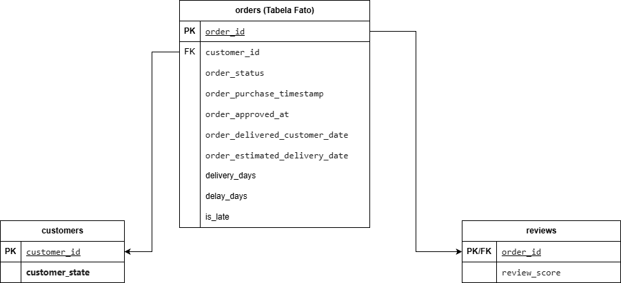

# Olist E-commerce Analysis

## Objetivo
Analisar pedidos do e-commerce Olist para identificar padrões de vendas, atrasos de entrega e impactos na satisfação do cliente.

## Perguntas respondidas
- Quantidade de pedidos ao longo do tempo
- Estados com maior volume de pedidos
- Tempo médio de entrega
- Estados com maior incidência de atrasos
- Relação entre atraso e avaliação do cliente

## Principais insights
- O volume de pedidos cresce ao longo do tempo, com indícios de sazonalidade
- Estados do Sudeste concentram a maior parte do volume de pedidos
- O tempo médio de entrega é de aproximadamente 12 dias
- Quando ocorrem atrasos, eles representam em média 6 dias adicionais ao prazo estimado
- Pedidos entregues com atraso apresentam avaliações médias menores
- Estados como Alagoas apresentam taxa média de atraso próxima a 20%, cerca de 14 pontos percentuais acima da média nacional (~6%)

## Estrutura do projeto
- data/ → arquivos CSV utilizados na análise
- notebooks/ → notebook principal da análise exploratória
- images/ → gráficos e diagrama de modelagem

## Fonte dos dados
Os dados utilizados neste projeto são públicos e foram obtidos no Kaggle:
Olist Brazilian E-commerce Dataset.

Por questões de tamanho e licenciamento, os arquivos CSV não estão versionados no repositório.

## Ferramentas
- Python
- Pandas
- Matplotlib

## Modelagem de dados
Foi adotado um modelo relacional simplificado, focado nas tabelas e atributos utilizados na análise, com a tabela de pedidos como fato central e dimensões de clientes e avaliações.

